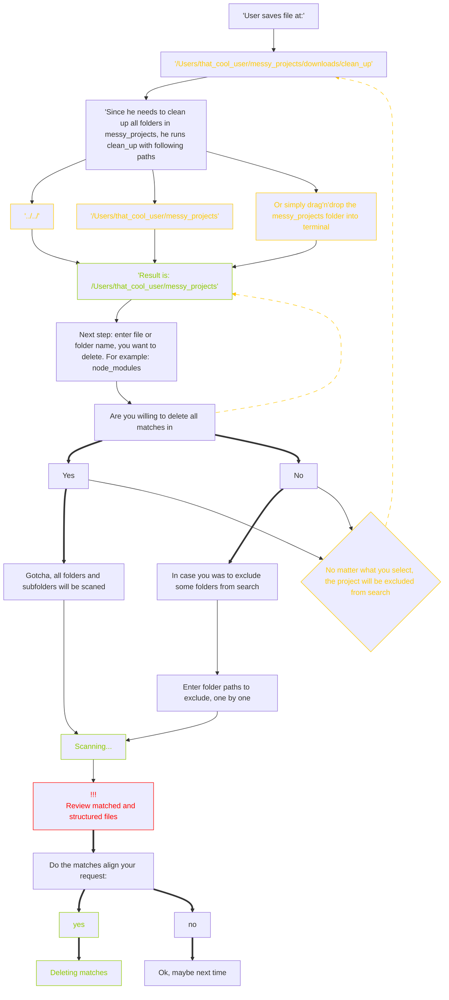

<div align="center">
  
</div>
<h1 align="center">@jstormer/trashpanda 🦝</h1>

A simple Node.js script to find and delete all matching folders or files.

The author was too lazy to manually delete all node_modules folders on his laptop. He also tried to find them using macOS Finder, but the results were overwhelming and included many files that were probably related to node_modules. Because of that, it wasn’t clear what was safe to delete — so this script was born 🙂
</br>
<div align="center">
<h2>🫠 Let the fun begin</h2>

</div>

## Installation:
The installation process is very simple, especially if you already have experience with npm or Node.js:
```

 $ npm i -g trash-panda && trashpanda

 ```

## Flow:




<div align="center">
<h2>🎉🎉🎉 Congrats, we made it through</h2>

</div>


<p>P.S. Since someone already made a useless package called trashpanda about 10 years ago, I had to go with <b><u>@jstormer/trashpanda</u></b>. But in my heart, it will always be TrashPanda.✌️</p>